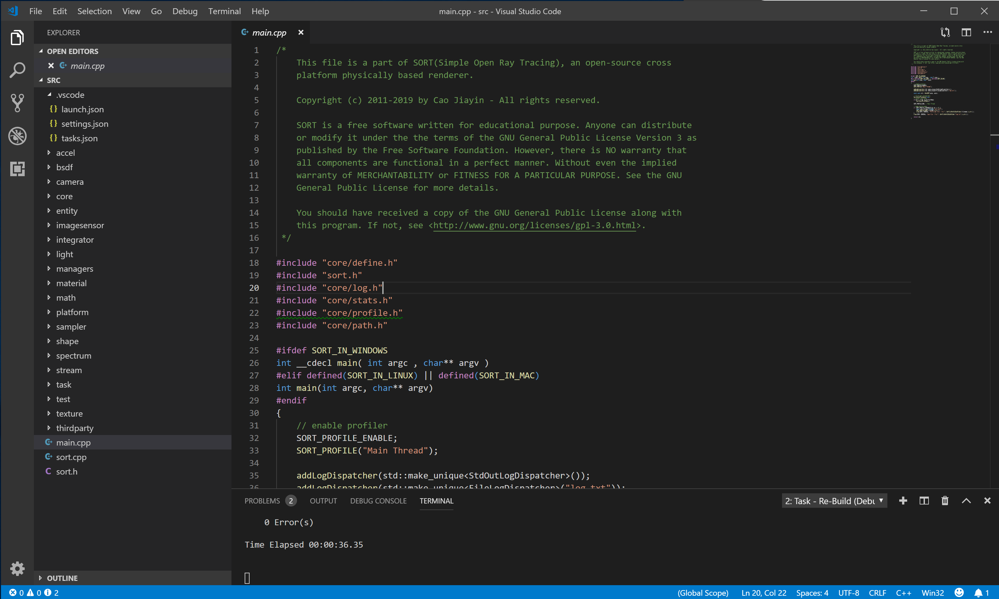
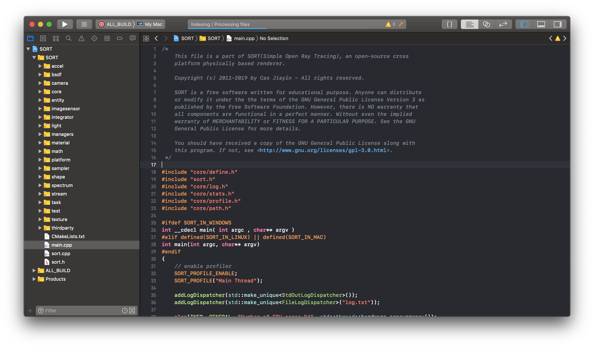
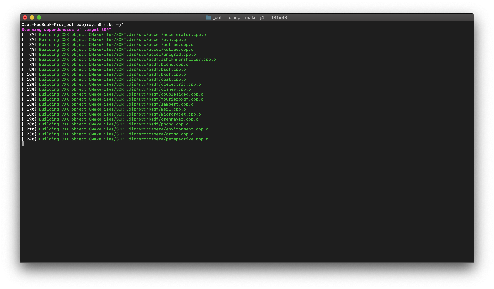
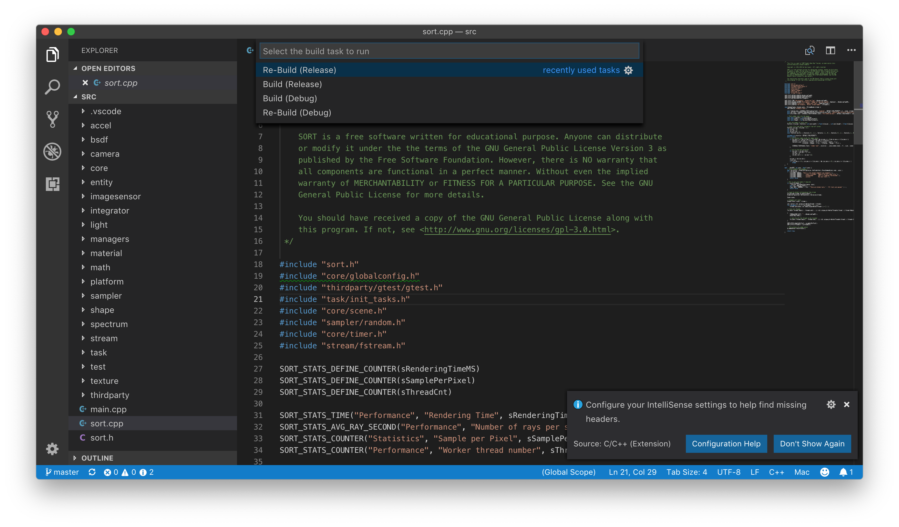

SORT is a cross-platform project that runs on multiple platforms, including Windows, Mac OS, and Ubuntu.
It is a fully open-source, meaning that everyone can compile it by themselves.

Following are the mandatory software to compile SORT:
* [CMake](https://cmake.org/) (3.1 or higher version).
* C++ compiler that compiles C++14.
* [Blender](https://www.blender.org/) (2.7 or higher version). It is not a mandatory software to run SORT if there is already a resource file. However, since the input scene file is generated by Blender through SORT Blender Plugin, it is necessary to install Blender to generate input scene files.

# Compiling SORT

## Platform Independent Compiling Options
There are only a few compiling options for us to pay attention in SORT CMake generation.

* **CMAKE_BUILD_TYPE**  
This is set 'Release' by default. Choose 'Debug' if you want to generate a debug build. If you only want to build SORT for running it, there is no need to touch this option.
* **SORT_ENABLE_PROFILER**  
This is a very performance sensitive option. It is turned on by default. However, it is totally fine to disable profiling feature in SORT because this will be a pretty big performance issue for reasonable complex scene rendering.
* **SORT_ENABLE_STATS**  
This will enable SORT to output some statistics information after running SORT. It is also turned on by default.
This feature has very limited impact on rendering performance. Leaving it on should be generally fine. However, it is also fine to turn it off if there is no need to check the statistics data after rendering.

## Download Dependencies before Compiling
SORT uses a third-party library that is not deployed with the source code together. In order to compile SORT successfully, it is mandatory to download the dependencies before compiling. Otherwise, it will have trouble locating the library, leading to the error in CMake generation.

To download the dependency files, run 'getdep_linux.sh' or 'getdep_win.ps1' to retrieve it. However, if the script doesn't work somehow, it is also fine to [download](http://45.63.123.194) the file directly. It is necessary to make sure the platform matches the target platform it runs on. The exact folder to put the dependencies should be 'dependencies' in the root folder. It should look like this SORT_Root/dependencies/easy_profiler/(bin/lib/include).

The last resort is to compile the library with [source code](https://github.com/yse/easy_profiler) by yourself. This is not suggested to compile the source code of easy_profiler due to potential changes in different version may cause unknown problems in SORT. The pre-compiled ones are more desired than compiling it by yourself.

## Windows
* **Compile with Visual Studio**  
Compiling on Windows with Visual Studio project is relatively easy. Just generate the solution file and open it with the correct version of Visual Studio.

* **Compile with Visual Studio Code**  
SORT can also be compiled on Windows with the Build tools for Visual Studio and Visual Studio Code. Install [Build tools for Visual Studio](https://visualstudio.microsoft.com/downloads/#build-tools-for-visual-studio-2017) first, there is no need to install other components of Visual Studio, just the Build tool should be good enough. After installing the Build tool, it is necessary to put the path where MSBuild.exe is in the system path parameter. In my case, it is C:\Program Files (x86)\Microsoft Visual Studio\2017\BuildTools\MSBuild\15.0\Bin. It could be different depending on your machine depending on VS Build tool version. [VS code](https://code.visualstudio.com/download) also needs to be installed.  
After installing both VS Code and Build tool for Visual Studio, simply start VS code and open the folder 'src' in the SORT root folder. Choose 'Run Task' in Terminal menu and then pick the corresponding option.

* **Other Compiling Options**  
Compiling SORT on Windows with Cygwin or MinGW may also be possible. However, I have not intensively tested it before, it is not very suggested. And more importantly, it is not exactly a Windows permutation of the source code, unknown issues may arise between Blender Plugin and SORT.

## Mac OS
Compiling SORT on Mac OS is straightforward and easy. There are several ways to compile SORT on Mac.
* **Compile with XCode**  
Start CMake and pick the SORT root folder as source code folder, not the 'src' folder in the root folder. For the second option 'Where to build the binaries', it is suggested to use '_out' because Git will ignore this folder with SORT settings, although all paths work well. In the configuration window, choose XCode.  
And then generate the project and open the project. Building the project is very standard, choose 'Build' in the 'Product' menu. It is suggested to build release version for best performance.

* **Compile with makefile**  
Generation of makefile is a very similar process with XCode project generation, which will won't be mentioned. Please refer the above way to generate it. Make sure adding '-j4' to activate multi-thread compiling to accelerate compilation if there is mult-core in the CPU.

* **Compile with Visual Studio Code**  
Building SORT with VS Code on Mac is highly suggested due to its simplicity. Download [VS code](https://code.visualstudio.com/download). And simply start VS code and open the folder 'src' in the SORT root folder. Choose 'Run Task' in Tasks menu and then pick the corresponding option. This process should be very similiar with the same process on Windows platform.

* **Compiling with other tools**  
Compiling SORT with other tools, like [CodeBlock](http://www.codeblocks.org/), [Sublime](https://www.sublimetext.com/), is also possible. But you will most likely not have the best debugging experience, for which reason it is not strongly suggested.

## Ubuntu
Unlike the other two platforms, for which SORT has packed all necessary libarary in the dependencies, some of the depedent library is OS dependent. SORT doesn't pack those OS dependent library with it, it is programmer's responsibility to setup the correct environment before building it, meaning compiling SORT on Ubuntu requires some basic setup first. Following is the tools and library needed by SORT and the correct way to install them on Ubuntu 16.0.x (Xenial)
- OpenEXR
  - sudo apt-get install libopenexr-dev
- Boost
  - sudo apt-get install libboost-all-dev
- Clang 6
  - wget -O - https://apt.llvm.org/llvm-snapshot.gpg.key \| sudo apt-key add -
  - sudo apt-add-repository "deb http://apt.llvm.org/xenial/ llvm-toolchain-xenial-6.0 main"
  - sudo apt-get update
  - sudo apt-get install -y clang-6.0
- G++ 7, the default version GCC on Ubuntu Xenial won't compile SORT successfully.
  - sudo apt-get install -y software-properties-common
  - sudo add-apt-repository ppa:ubuntu-toolchain-r/test
  - sudo apt update
  - sudo apt install g++-7 -y
  - sudo update-alternatives \-\-install /usr/bin/gcc gcc /usr/bin/gcc-7 60 --slave /usr/bin/g++ g++ /usr/bin/g++-7
  - sudo update-alternatives \-\-config gcc
  
Warning, please make sure your Ubuntu version is 16.0.x LTS (Xenial), the above dependencies may be different on other version Ubuntus. And most of the above library is needed because of OSL dependencies, another version of the above library may result in failing in the compilation process.

Unfortunately, due to limited resources, I don't have a Ubuntu 18.0.x now. If you happen to build SORT on that version, you probably need to rebuild OSL library by yourself, which you can consult this [OSL main page](https://github.com/imageworks/OpenShadingLanguage) for detail information. I'll update this part once I have access to a machine installed with Ubuntu 18.0.x.

After setting up the environment, the rest of the process is no different from compiling SORT on MacOS except that there is no XCode support. You can either compile it with terminal or VS Code.

# Generated Binary
Only one executable file will be generated. It will be generated in a newly created folder 'bin' in the SORT root folder. For release version build, an executable named 'sort_r' will be generated. For debug version build, it is named 'sort_d'.
