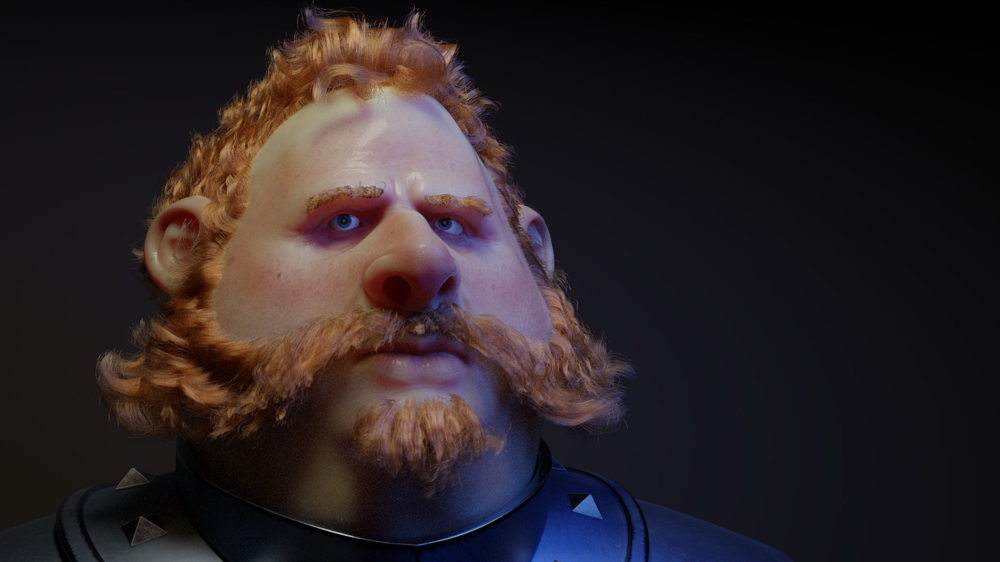
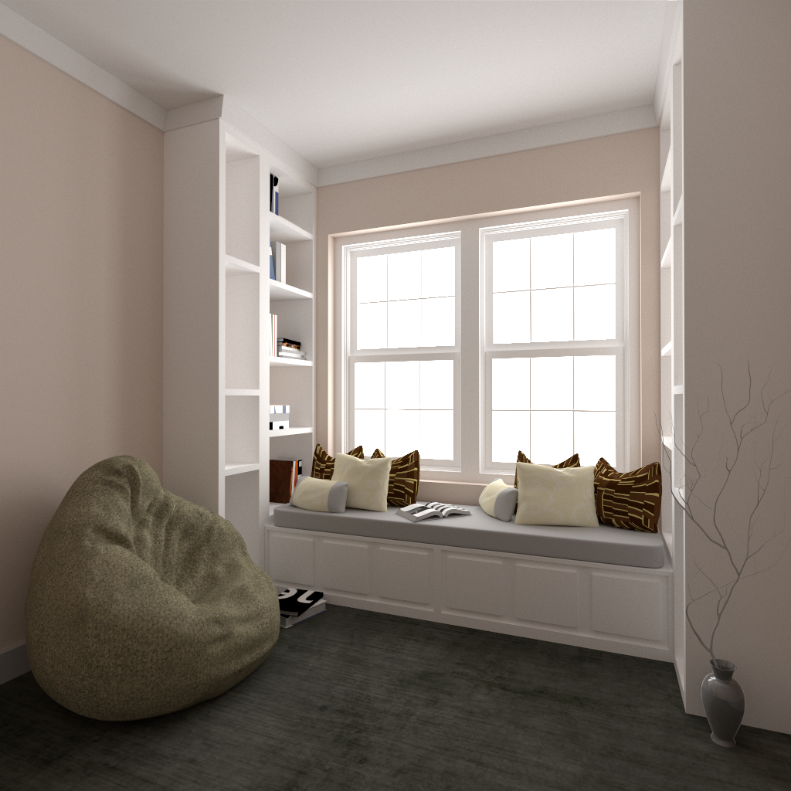
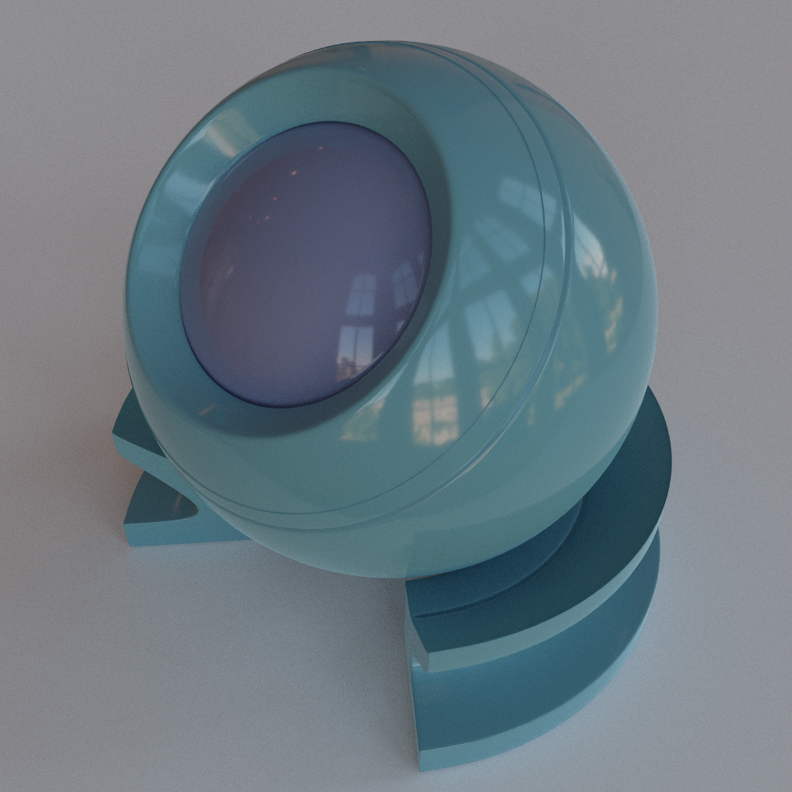
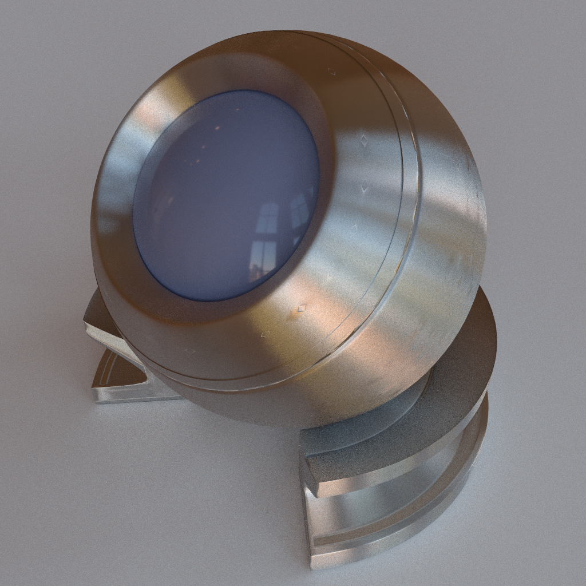
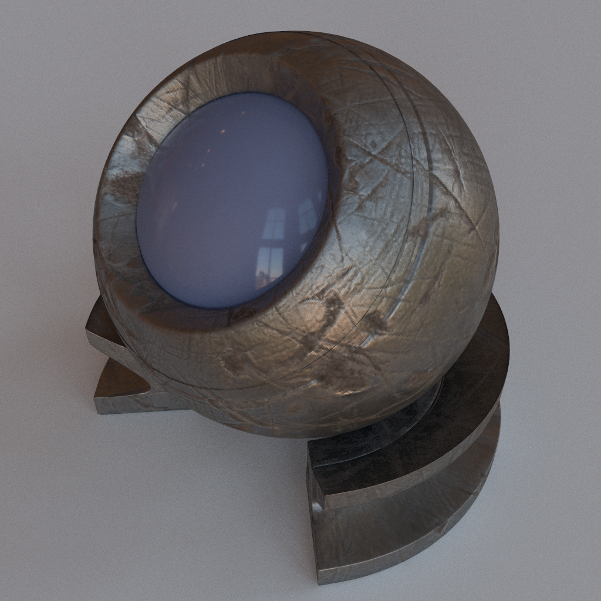
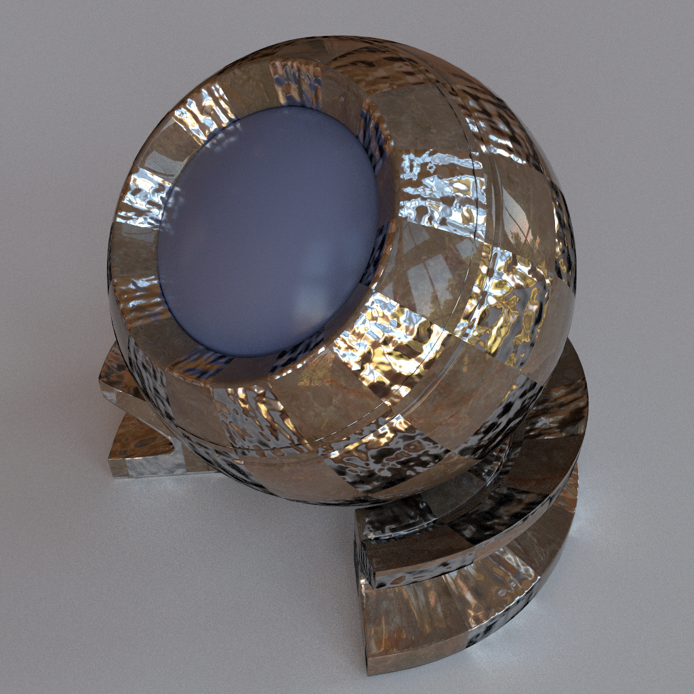
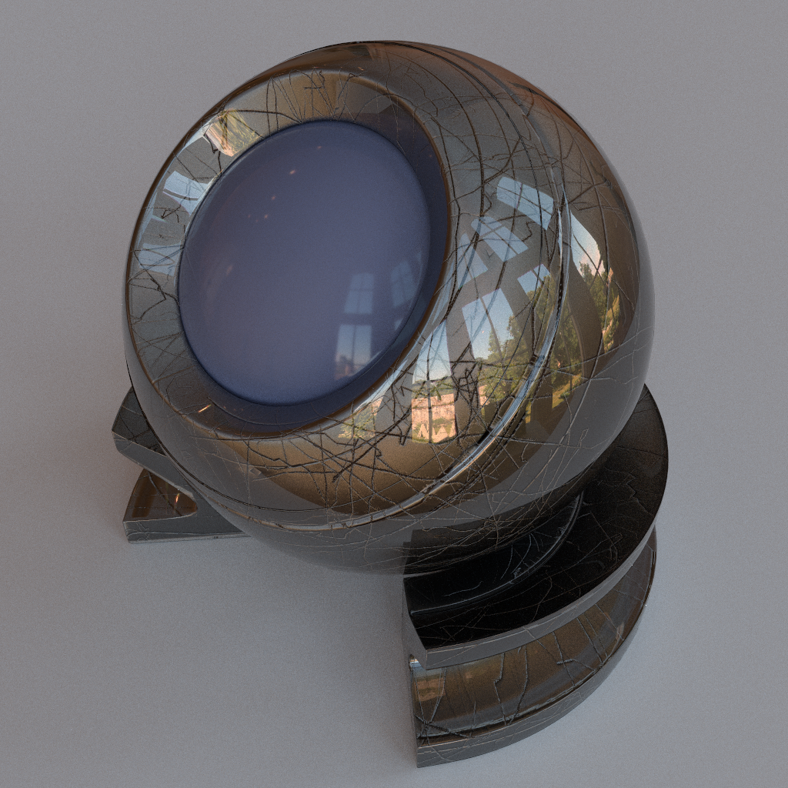

SORT, short for Simple Open-source Ray Tracing, is my personal cross platform ray tracing renderer. It is a standalone ray tracing program, while works well in Blender as a renderer plugin. Simliar to other open source ray tracer, like PBRT, luxrenderer, SORT is also a physically based renderer. However, since it is a solo project that I worked on in my spare time, it is way simpler comparing with others.  

## Features

Here are the features implemented so far:
  - Integrator. (Whitted ray tracing, direct lighting, path tracing, light tracing, bidirectional path tracing, instant radiosity, ambient occlusion)
  - Spatial acceleration structure. (KD-Tree, BVH, Uniform grid, OcTree)
  - BXDF. (Disney BRDF, Lambert, LambertTransmission, Oran Nayar, MicroFacet Reflection, Microfacet Transmission, MERL, Fourier, AshikhmanShirley, Modified Phong, Coat, Blend, Double-Sided)
  - Node graph based material system.
  - Camera. (DOF)
  - Multi-thread rendering.
  - Blender plugin.
  - Fur.

## Gallery
Following are some examples of images generated by SORT

## Materials System in SORT
Featuring a flexible graph node material system, SORT is designed to support a wide variaty of materials. Most of the parameters in its BRDF could be driven by textures, providing quite some freedom in term of its material design. Following is a screenshot of SORT working in Blender

Here are some of the examples rendered by SORT  

## Compilation and Deployment
For those who are interested in compiling SORT by themselves, please check out [this page](/compilation.md) for further deatail.  
After compiling SORT successfully, it is nessesary to install Blender plugin to start rendering in SORT, [this page](/deployment.md) mentioned all detailes needed.

## About me & Contact
I’m a senior graphics engineer at Ubisoft Singapore currently working on Skull and Bones, improving graphics rendering in the game engine. Prior to joining Ubisoft, I was a geforce devtech at NVIDIA Shanghai. My job at NVIDIA was to support third party developers with latest NVIDIA technologies and help them solve the issues they encountered during game development.

For those who wants to connect, for whatever reason, please contact me through the following media
* [Linkedin](https://www.linkedin.com/in/caojiayin/)
* [Twitter](https://twitter.com/Cao_Jiayin)
* [Email](mailto:caojiayin1985@gmail.com)
* [Tech Blog](https://agraphicsguy.wordpress.com/)
